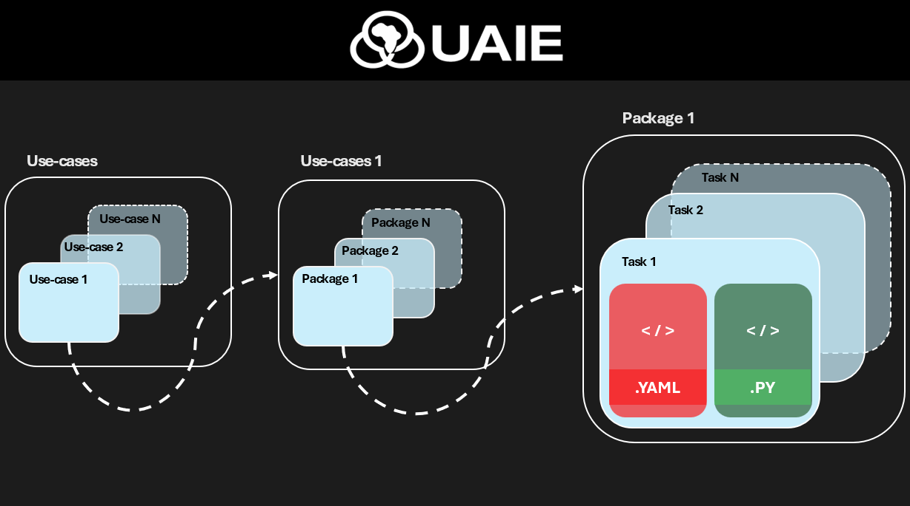

# Project Structure

A typical Ubunye project lays out pipelines by **use-case → pipeline → task**,
mirroring how `ubunye init` and `ubunye run` address tasks.



---

## Recommended layout

```
my_project/
├── pipelines/                     ← root task directory (-d flag)
│   └── fraud_detection/           ← use-case (-u flag)
│       └── ingestion/             ← pipeline (-p flag)
│           └── claim_etl/         ← task (-t flag)
│               ├── config.yaml
│               ├── transformations.py
│               └── notebooks/
│                   └── claim_etl_dev.ipynb  ← interactive dev notebook
├── .ubunye/
│   ├── lineage/                   ← run provenance (--lineage flag)
│   └── model_store/               ← model registry artifacts
├── pyproject.toml
└── mkdocs.yml
```

---

## Task folder

| File | Purpose |
|---|---|
| `config.yaml` | Declares inputs, transform, outputs, engine, orchestration |
| `transformations.py` | Python transform (`Task` subclass) |
| `model.py` | Optional ML model (`UbunyeModel` subclass) for `type: model` transforms |
| `notebooks/<task>_dev.ipynb` | Interactive dev notebook (Databricks-ready) |

Every task is **self-contained**. The config is the single source of truth for what runs and where.

---

## config.yaml skeleton

```yaml
MODEL: etl          # or ml
VERSION: "1.0.0"    # semver

ENGINE:
  spark_conf:
    spark.sql.shuffle.partitions: "200"
  profiles:
    dev:
      spark_conf:
        spark.sql.shuffle.partitions: "4"

CONFIG:
  inputs:
    my_input:
      format: hive
      db_name: raw
      tbl_name: events

  transform:
    type: noop        # noop | task | model | <custom>
    params: {}

  outputs:
    my_output:
      format: delta
      path: s3://bucket/clean/events
      mode: overwrite

ORCHESTRATION:
  type: airflow
  schedule: "0 2 * * *"
  retries: 3
  owner: data-engineering
```

---

## Engine library layout (reference)

```
ubunye/
├── api.py          — Public Python API (run_task, run_pipeline)
├── core/           — Engine, Registry, interfaces (Reader/Writer/Transform/Task/Backend)
├── config/         — YAML loader, Jinja resolver, Pydantic schema
├── backends/
│   ├── spark_backend.py      — Creates new SparkSession
│   └── databricks_backend.py — Reuses active SparkSession (Databricks)
├── plugins/
│   ├── readers/    — hive, jdbc, unity, rest_api, s3
│   ├── writers/    — s3, jdbc, unity, rest_api
│   ├── transforms/ — noop, model_transform
│   └── ml/         — BaseModel, SklearnModel, SparkMLModel (internal wrappers)
├── models/         — UbunyeModel contract, loader, registry, gates
├── cli/            — main, lineage, models, test sub-apps
├── lineage/        — RunContext, LineageRecorder, FileSystemLineageStore
└── telemetry/      — events, mlflow, prometheus, otel, monitors protocol
```

---

## Environment profiles

Profiles let you override Spark config without duplicating YAML:

```yaml
ENGINE:
  spark_conf:
    spark.executor.memory: "8g"
  profiles:
    dev:
      spark_conf:
        spark.executor.memory: "512m"
        spark.sql.shuffle.partitions: "4"
    prod:
      spark_conf:
        spark.executor.memory: "32g"
```

Select at runtime:

```bash
ubunye run -d pipelines -u fraud -p etl -t claims -m dev
ubunye run -d pipelines -u fraud -p etl -t claims -m prod
```

Or via the Python API:

```python
import ubunye

ubunye.run_task(task_dir="pipelines/fraud/etl/claims", mode="dev")
```

---

## Next steps

- [Config Reference →](../config/overview.md)
- [Connectors →](../connectors/overview.md)
- [CLI Reference →](../cli.md)
