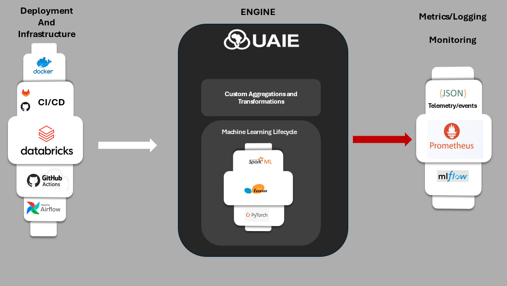

# Ubunye Engine

Ubunye Engine is a **config-first, Spark-native framework** for building ETL and ML pipelines
that run everywhere — locally, on-prem, or in the cloud (Databricks, EMR, Glue).

Define your pipeline in YAML. Write a Python class. Run it.



---

[**Get started in 5 minutes →**](getting_started/quickstart.md){ .md-button .md-button--primary }
[**GitHub →**](https://github.com/ubunye-ai-ecosystems/ubunye_engine){ .md-button }

---

## Why Ubunye?

| Concern | How Ubunye handles it |
|---|---|
| I/O boilerplate | Declarative connectors (Hive, JDBC, S3, Delta, REST API, Unity Catalog) |
| Config drift between environments | Jinja2 templating + per-profile Spark overrides |
| ML lifecycle management | Library-independent `UbunyeModel` contract + built-in registry |
| Observability | Pluggable lineage tracking, Prometheus, OpenTelemetry, MLflow |
| Orchestration | One-command export to Airflow, Databricks, Prefect, Dagster |
| Testing | Spark-free unit-test patterns; 288 tests in CI |

## Key Features

- **Config-first** — all I/O, compute, and orchestration is YAML-driven; no hardcoded credentials or paths.
- **Plugin system** — extend via Python entry points (`ubunye.readers`, `ubunye.writers`, `ubunye.transforms`).
- **Model registry** — version, promote, rollback, and gate ML models without coupling to any ML library.
- **Lineage tracking** — automatic run provenance written to `.ubunye/lineage/`.
- **Telemetry-ready** — Prometheus, OpenTelemetry, and JSON event logs via the `monitors` protocol.
- **Orchestration export** — generate Airflow DAGs or Databricks job JSON from the same config.

## Two entry points

=== "CLI"

    ```bash
    ubunye run -d pipelines -u fraud -p etl -t claims -m PROD --lineage
    ```

=== "Python API (Databricks)"

    ```python
    import ubunye

    outputs = ubunye.run_task(
        task_dir="pipelines/fraud/etl/claims",
        mode="PROD",
        dt="2024-06-01",
    )
    ```

The Python API auto-detects and reuses an active SparkSession on Databricks.
When no session exists, it creates one — same as the CLI.

## Quick Example

```yaml
# pipelines/fraud/etl/claims/config.yaml
MODEL: etl
VERSION: "1.0.0"

CONFIG:
  inputs:
    raw_claims:
      format: hive
      db_name: raw
      tbl_name: claims
  transform:
    type: noop
  outputs:
    clean_claims:
      format: delta
      path: s3://data-lake/clean/claims
      mode: overwrite
```

```bash
ubunye run -d pipelines -u fraud -p etl -t claims -m PROD
```

## Documentation Map

- [Installation](getting_started/install.md) — install, verify, extras
- [Quickstart](getting_started/quickstart.md) — end-to-end in 5 minutes
- [Config Reference](config/overview.md) — full YAML schema
- [Connectors](connectors/overview.md) — all built-in readers and writers
- [ML — Model Contract](ml/model_contract.md) — the `UbunyeModel` ABC
- [ML — Registry](ml/registry.md) — versioning, promotion, gates
- [CLI Reference](cli.md) — all commands and flags
- [API Reference](api.md) — Python API (`run_task`, `run_pipeline`)
- [Deployment](deployment.md) — Databricks Asset Bundles + GitHub Actions
- [Developer Guide](dev_guide.md) — architecture, plugins, testing
